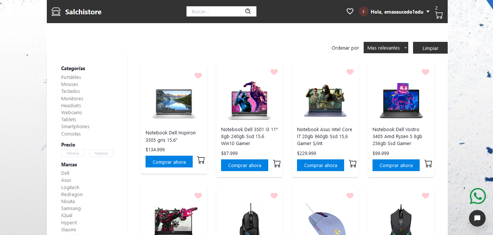
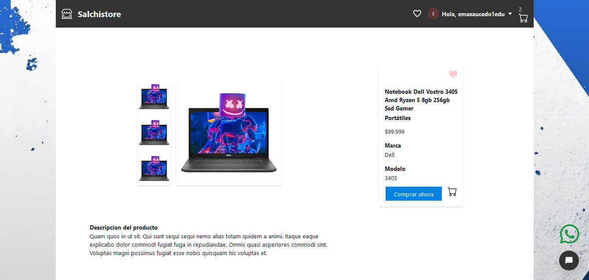
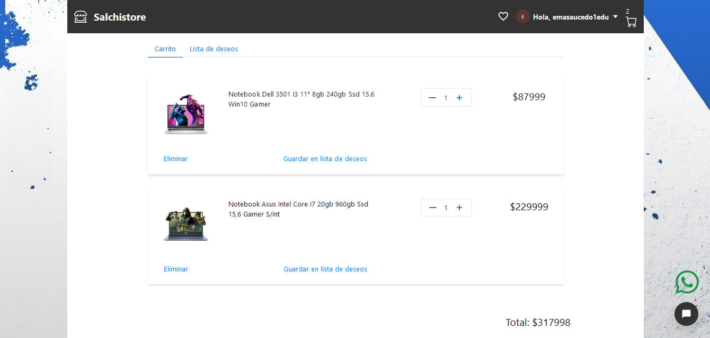
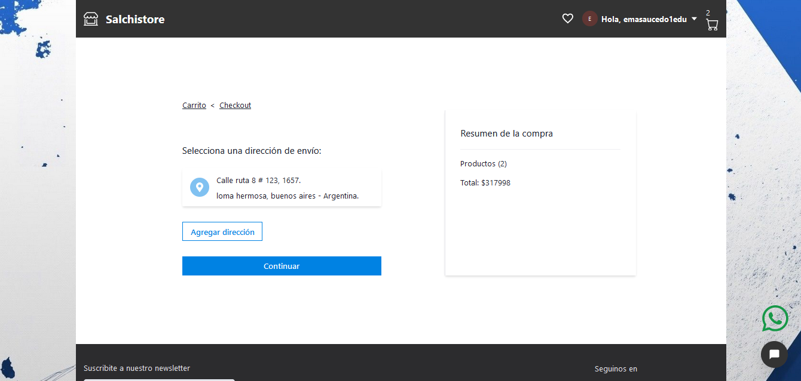
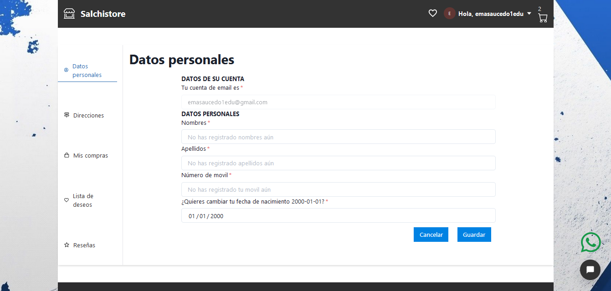
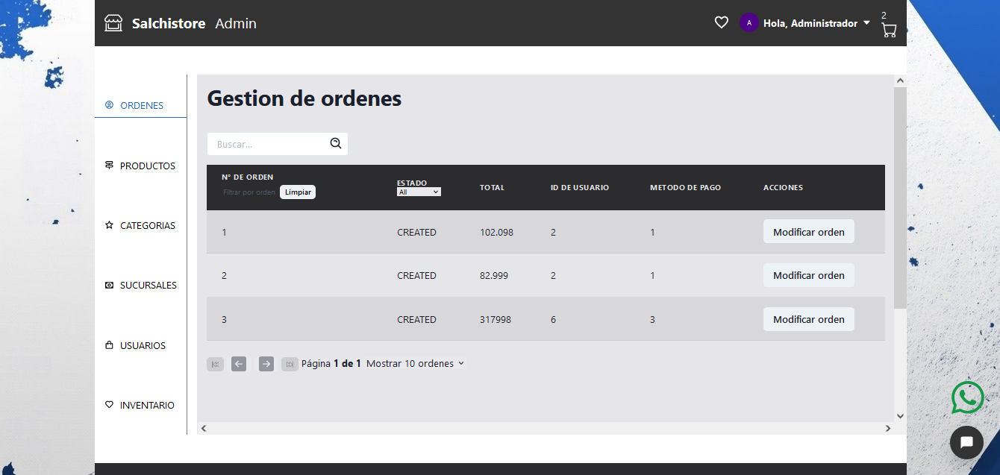

<p align='left'>
    
</p>

# Henry

# Salchistore

## Introduction

This is a student group project done as a first big assigment, in wich join all the technologies learned at SoyHenry bootcamp.


## Project Objetives

- Build a JavaScript App from scratch
- Afirm and conect all the learned concepts in the Carreer 
- Learn and practice GIT workflow / team work
- Use scrum agile methodology

## Stack of Technologies

### Front End:
HTML, CSS, Chakra UI, Javascript, React, Redux

### Back End:
Node.js, Express, Firebase, Nodemailer, Sequelize.

### Database:
PostgreSQL

## **Starting Instructions** 

__IMPORTANT:__ Necesary version of node and NPM 

 * __Node__: 12.18.3 or higher
 * __NPM__: 6.14.16 or higher

 
## BoilerPlate

The boilerPlate has two folders: `api` and `client`.

Inside `api` you must have to create a file called: `.env` 
that has the following form: 

```
DB_USER=userpostgres
DB_HOST=localhost
DB_PASSWORD=passwordpostgres
MERCADO_PAGO_ACCESS_TOKEN=APP_USR-1367375121602086-051803-90c99508dde6a50d3250624a47407451-1125857923
CLOUD_NAME=dqqbrzze8
CLOUDINARY_API_KEY=212832446582656
CLOUDINARY_API_SECRET=xRzRm1iNiyhn9Cm5vr8ET9xLfvs
```

You have to replace `postgresuser` and `postgrespassword` with your own credentials to connect to postgres database. This file will be ignored by github, as it contains sensitive information (the credentials).

Inside `client` you must have to create a file called: `.env` 
that has the following form:

```
REACT_APP_MERCADO_PAGO_ACCESS_TOKEN=APP_USR-1367375121602086-051803-90c99508dde6a50d3250624a47407451-1125857923
```

## Next 
### _Connect the data base_

 - Go to your postgres database manager and create a new   database called `ecommerce`, this is the name of the database to which we will connect.

### _Install the necesary package to run it_

- Open the project console
    + Inside `api` folder, run the command line, `npm install`
    + Inside `client` folder, run the command line, `npm install` 

### _Run the project_

- Open the project console
    + Inside `api` folder, run the command line, `npm run dev`
        
    + Inside `client` folder, run the command line, `npm start` (go to http://localhost:3000/) 

# For testing

- You can find in `api/index.js`
    + `conn.sync({ force: false })`, switch it between " true " ( if you want reset database in each loaded ) or " false "( if you dont want reset database in each loaded ) 

- You can use a testing admin user with login credentials:
    + username : `admin@admin.com`
    + password : `1234567a`

# To buy with mercadopago

- Target number: 4013 5406 8274 6260
- Name: APRO
- Code: 123
- DNI: 12345678
- Mail: test_user_16455810@testuser.com


# Project Screens

# Home


# Product Detail


# Cart


# Checkout


# User profile


# Admin panel

